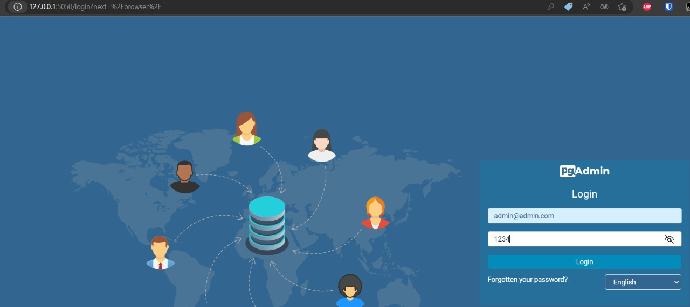
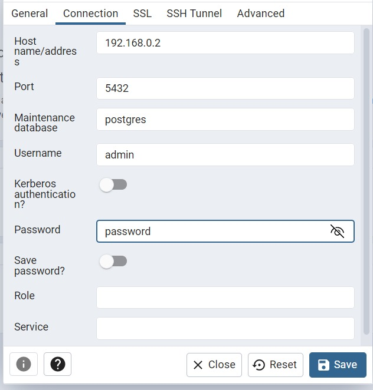

# Guida sul db e container
## Far partire il container 
* Se si vuole far partire il container eseguire il comando `docker compose up`.
* Se si vuole far partire il container dandogli un nome a piacere eseguire il comando `docker-compose -p 
"nomedadarealcontainer" up -d`
## Accesso a pg admin
* Accedere al link [127.0.0.1:5050](127.0.0.1:5050 "pgAdmin").
* Per accedere a pg admin inserire le seguenti credenziali: 
   * username admin@admin.com
  * password "1234"    

## Aggiungere il server postgres a pgadmin
Per aggiungere il server a pgadmin bisogna usare le seguenti credenziali:
* hostname: 192.168.0.2
* port: 5432 (è quella di default)
* username: admin
* password: password  
